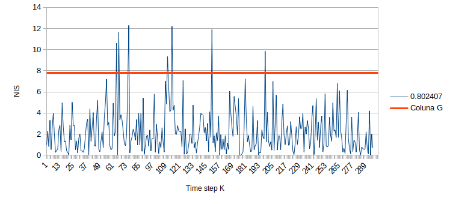
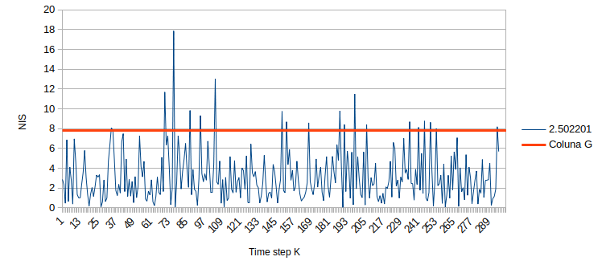

# SFND Unscented Kalman Filter

This work presents the algorithm and results obtained with the third project proposed by Udacity Sensor Fusion Engineer Nanodegree program. The main task of this project is the state estimation with Unscented Kalman Filter (UKF) of multiple cars on a highway using noisy lidar and radar measurements.

[`ukf.cpp`](src/ukf.cpp) contains the Unscented Kalman Filter implementation, the block diagrams of the algorithm is shown in the figure bellow. An explanation about the UKF can be found [here](https://www.seas.harvard.edu/courses/cs281/papers/unscented.pdf).

  
  <em> Fig. 1 - Schematic (Source: Udacity)</em>

[`main.cpp`](src/main.cpp) is using [`highway.h`](src/highway.h) to create a straight 3 lane highway environment with 3 traffic cars and the main ego car at the center. 
The viewer scene is centered around the ego car and the coordinate system is relative to the ego car as well. The ego car is green while the 
other traffic cars are blue. The traffic cars will be accelerating and altering their steering to change lanes. Each of the traffic car's has
it's own UKF object generated for it, and will update each indidual one during every time step. 

The red spheres above cars represent the (x,y) lidar detection and the purple lines show the radar measurements with the velocity magnitude along the detected angle. The Z axis is not taken into account for tracking, so you are only tracking along the X/Y axis.

## Results

  

The Root Mean Square Error (RMSE) obtained with UKF using different sensors set are presented in the table bellow.

|     |  LIDAR | RADAR | LIDAR + RADAR |
| --- | ------ | ----- | ------------- |
|  Px | 00.1261 | 08.4640 | 00.0519 |
|  Py | 00.0665 | 07.1496 | 00.0604 |
|  Vx | 01.1202 | 46.3181 | 00.5102 |
|  Vy | 00.4344 | 43.7210 | 00.3760 |

Normalized Innovation Squared (NIS). This metric follows a Chi-squared distribution, and gives an approximate idea of whether or not the parameters were initialized in the correct range. Fig. 2 and 3 shows NIS values for both LIDAR and RADAR based UKF, 

  
  <em> Fig. 2 - NIS radar</em>

  
  <em> Fig. 3 - NIS lidar</em>

---

## Other Important Dependencies
* cmake >= 3.5
  * All OSes: [click here for installation instructions](https://cmake.org/install/)
* make >= 4.1 (Linux, Mac), 3.81 (Windows)
  * Linux: make is installed by default on most Linux distros
  * Mac: [install Xcode command line tools to get make](https://developer.apple.com/xcode/features/)
  * Windows: [Click here for installation instructions](http://gnuwin32.sourceforge.net/packages/make.htm)
* gcc/g++ >= 5.4
  * Linux: gcc / g++ is installed by default on most Linux distros
  * Mac: same deal as make - [install Xcode command line tools](https://developer.apple.com/xcode/features/)
  * Windows: recommend using [MinGW](http://www.mingw.org/)
 * PCL 1.2

## Basic Build Instructions

1. Clone this repo.
2. Make a build directory: `mkdir build && cd build`
3. Compile: `cmake .. && make`
4. Run it: `./ukf_highway`
